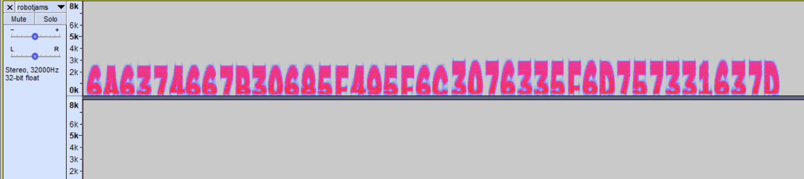

# after-all-this-time writeup

### Setup/tools used
FTK Imager - This tool was used to open the original .ad1 file given. It is Windows exclusive as far as I know. There are alternatives but this one makes your job easiest (though it was a nightmare to find/download a legitimate version that didn't look like malware).

Kali Linux - I mainly used Kali for John the Ripper, but being able to send files from FTK Imager to Kali Linux is crucial for completing this challenge.

KeePass 1.41 - This will be needed to view a database file. Annoyingly, this is a different version of KeePass than the one used for the crack-keepass challenge so you will need to download it again.

Audacity - This will be needed to view an audio file's spectrogram.

dcode.fr - This website, especially the "Cipher Identifier" page, helped a lot with getting this challenge done.

## Step 1

First off, opening the .ad1 file as evidence in FTK Imager gives you a bunch of files to comb through. It is an image file, so make sure to select that option when importing it as evidence to FTK Imager. 

Our main point of interest is at [root]/Users/User/Desktop currently. There are two files that read "nothingimportant.txt", one of which was deleted. These files give various hints about storing passwords and them being given a key to layer the security. 

There's also a PDF file of a book called "The Time Machine", which is where the first major puzzle lies. 

Just before we tackle that puzzle, it's worth noting that in [root]/Users/User/Documents, there is a folder called "security_keepout" which has a file called "beausFortressOfPwnitude.txt" which seems to have encrypted passwords. The name of the file references the Beaufort Cipher, but without a key, we cannot decode it currently.

Also, in the Desktop again, there's a KeePass database file called "keepsecure.kdb" which definitely seems worth looking into once we have a way in.

## Step 2

Upon looking at the PDF, two major things of note jump out. The second page has a note on it and some numbers and the final page has some highlighting via an comment shown by Adobe. Images of both of these are below.  

As it turns out, this is a Book Cipher. The numbers correspond to line-word-letter in that order. The note references the final page being the key, so trying out the cipher there gives us the word of "enigma".

## Step 3

We can now revisit the "beausFortressOfPwnitude.txt" file since we have a key for the cipher. Using the Beaufort Cipher with keyword "enigma" on the file contents after pulling them out of the disk image unencrypts the password dictionary. I should note that we had some issues deciphering all of the passwords in one go, but doing it in 2-3 sections worked out perfectly.

At this point, I sent the "keepsecure.kdb" file and the unencrypted password dictionary over to Kali Linux to give it to John the Ripper. The password hash can be extracted from keepsecure.kdb using the command `keepass2john keepsecure.kdb > temphash.txt`. Using nano or vi, remove the "keepsecure.kdb:" section of the extracted hash, and then run `john temphash.txt beausFortressOfPwnitude.txt` and it solved it in less than a second with the password of "TimeWaits4No1".

## Step 4

With our password in hand, we can now open up the KeePass database. There's a ton of funny stuff in here including references to Twitter going down the drain because of Elon Musk and a link to ChatGPT labeled as "for homework", but what we're actually looking for is an audio file called "robotjams.wav". This can be found in either the backup section of the database or in the email section, I definitely noticed at least 3 copies of it without even browsing around every entry.

We then opened up this "robotjams.wav" file in Audacity and saw nothing... at first. After clicking the dropdown on the name of the file and switching it to spectrogram mode, this is what we saw. 

While this is readable as is, it's worth noting that the dropdown you just used also has a "Spectrogram Settings" tab and changing the scale can help with the readability of the text.

## Step 5

After transcribing this spectrogram to text (6A6374667B30685F495F6C3076335F6D757331637D), dcode.fr's cipher identifier page pointed us to an ASCII converter, which then outputted the flag of jctf{0h_I_l0v3_mus1c} when using the HEX /2 section of the ASCII converter.

### And that's all!

This challenge was definitely a crazy one but my team somehow got first blood on it which is pretty cool. This was my first time doing a CTF and my first time doing a writeup so I'm sure there are thousands of ways for this to be improved, but hopefully it was readable enough to get the solution across. If you have any questions about this solution/writeup in general or confusion on my explanation, feel free to contact me at my email of dcm45@njit.edu. Also, a huge thank you to Alfred for creating this amazing challenge and for his hints to put me in the right direction as I was getting stuck on this at 2AM.
